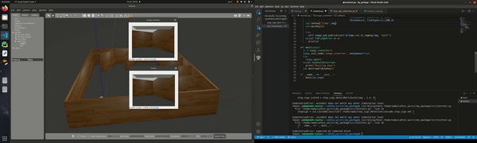
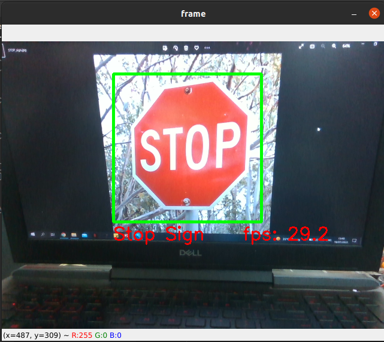
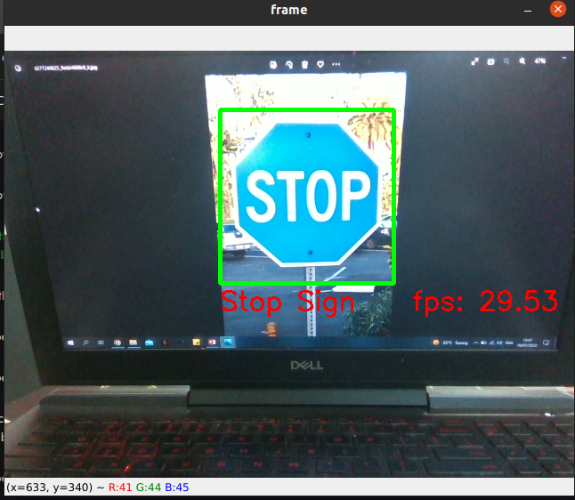

# High-fbs-cascade-classifier-for-stop-sign-detection-
High fbs cascade classifier for stop sign detection

Nada Abbas February 14, 2023

The main application was to detect and classify A stop sign. both methods were apple to identify the Sign cleary, but The first method was more faster based on FPS (frame per second) on the live capturing as shown in Figure (1)[ with](#_page0_x280.96_y474.65) cascade figures being on the left. The real-time processing FPS of the video file or webcam depending on the number of frames displayed per second. A video can be assumed as a collection of images or we can say frames which are displayed at some rate to produce motion. if you wish to identify the object in the video than 15 fps can be sufficient but if you wish to identify the car number which is moving at speed of 40 km/hr. on the highway then you would need at least 30 fps for hassle-free identification. Therefore, it will be good if we know how to calculate FPS in our Computer Vision projects.

 

Figure 1: Cascade classification

In order to connect the object detect process to ROS, A package was created to receive the image massage from the depth camera and then converted using cv - bridge provided by opencv into an opencv friendly image and then apply the cascade classification on it as shown in diagram (3). [The ](#_page1_x274.27_y642.99)system was then tested on gazebo world as shown in Figure (2)

The figure below shows the transition; sending and receiving of image topic among the camera package main node.

Figure 2: gazeboworld

Figure 3: TF for camera’s package
2
